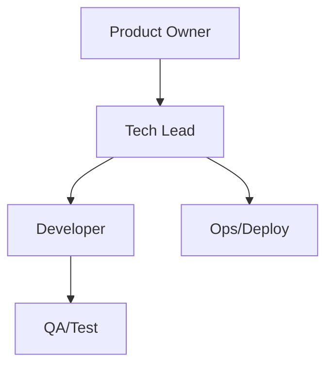

# Organigramma: Triathlon Planner SaaS

## 1. Overview
Questo documento definisce la struttura di ownership e le responsabilità operative per il progetto Triathlon Planner SaaS, garantendo una chiara visibilità sulla gestione del ciclo di vita del prodotto.

## 2. Internal Ownership
La responsabilità di tutte le aree critiche è attualmente centralizzata.

| Area | Owner |
| :--- | :--- |
| Product | Stefano Bonfanti |
| Tech | Stefano Bonfanti |
| Delivery | Stefano Bonfanti |
| Documentation | Stefano Bonfanti |
| Ops/Release | Stefano Bonfanti |
| QA | Stefano Bonfanti |

## 3. Project Roles
| Ruolo | Persona | Responsabilità |
| :--- | :--- | :--- |
| Product Owner | Stefano Bonfanti | Visione prodotto, roadmap, definizioni priorità |
| Tech Lead | Stefano Bonfanti | Scelte architetturali, stack, sicurezza |
| Developer | Stefano Bonfanti | Sviluppo, manutenzione, bug fix |
| Ops | Stefano Bonfanti | Gestione Vercel/Supabase, deploy, monitoraggio |
| Stakeholder | Stefano Bonfanti / Clienti | Validazione, feedback funzionale |

## 4. Organigramma Sintetico

## 5. Contatti e Dipendenze
*   **Repository Principale**: `triathlon-planner-saas`
*   **Stack Tecnico**: React (TypeScript/Vite), Supabase, Vercel.
*   **Governance e Standard**: Il progetto eredita processi, template e configurazioni da `opencode-config` (source of truth per il framework ZBN).
