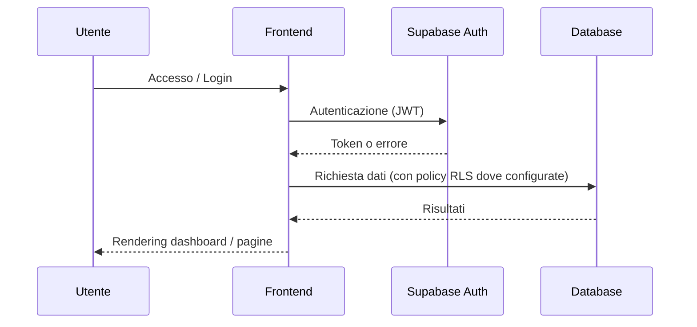

# Triathlon Planner SaaS – Project Overview

📌 **Summary**  
Triathlon Planner SaaS è una piattaforma web centralizzata per la gestione di atleti, calendari gare e attività operative per società di triathlon. Il sistema supporta atleti e amministratori nella pianificazione tecnica e nel monitoraggio delle attività di team.

## 📊 Snapshot di progetto

| Componente     | Specifica                                                         |
| :------------- | :---------------------------------------------------------------- |
| **Prodotto**   | Piattaforma SaaS di gestione triathlon                           |
| **ID**         | PRJ-001                                                          |
| **Stato**      | running                                                          |
| **Frontend**   | React, TypeScript, Vite, Tailwind CSS (versione esatta da confermare) |
| **Backend**    | Supabase (Auth, PostgreSQL)                                      |
| **Hosting**    | Vercel (produzione/anteprima – configurazione prevista)          |
| **Doc. chiave**| `technical-spec.md`, `runbook.md`, `org-chart.md`               |
| **Next action**| Follow-up proposta CUS Propatria Milano                          |

## 🧩 Architettura ad alto livello

```mermaid
flowchart LR
    User[\"Browser / Utente\"] --> FE[\"Frontend React/Vite\"]
    
    subgraph \"Supabase\"
      AUTH[\"Auth (JWT)\"]
      DB[(\"PostgreSQL\")]
    end
    
    FE -- \"API/Auth\" --> AUTH
    FE -- \"CRUD\" --> DB
    
    subgraph \"Moduli UI\"
      DASH[\"Dashboard\"]
      CAL[\"Team Calendar\"]
      ADM[\"Admin\"]
      RACE[\"Race Detail\"]
    end
    
    FE --> DASH
    FE --> CAL
    FE --> ADM
    FE --> RACE
```

## 🔁 Flusso principale utente



L’utente accede tramite autenticazione gestita da Supabase; il frontend interroga il database applicando le policy di sicurezza (RLS) dove implementate e configurate.

## 🧱 Moduli funzionali

| Modulo        | Scopo principale                                       |
| :------------ | :----------------------------------------------------- |
| Dashboard     | Visualizzazione riassuntiva attività, alert e scadenze |
| Team Calendar | Pianificazione e visualizzazione gare di squadra       |
| Admin         | Gestione utenti, ruoli e team                          |
| Race Detail   | Dettaglio tecnico delle gare e dati correlati          |

## 🛡️ Sicurezza (vista high-level)

```mermaid
flowchart TB
    U[\"Utente\"] --> AUTH[\"Supabase Auth (JWT)\"]
    AUTH --> RLS[\"RLS (Row Level Security)\\nper isolamento per team (da verificare/rafforzare)\"]
    RLS --> DB[(\"PostgreSQL\")]
```

- Autenticazione gestita da Supabase Auth.  
- Obiettivo: usare RLS per limitare l’accesso ai dati del singolo team; stato e copertura vanno verificati periodicamente rispetto allo schema corrente.  

Dettagli e checklist sono descritti in `docs/project/technical-spec.md` e `docs/project/runbook.md`.

## ⚙️ Operatività & runbook

```mermaid
flowchart LR
    DEV[\"Sviluppo locale\"] --> BUILD[\"Build & Test\"]
    BUILD --> REL[\"Release su Vercel (live)\"]
```

- **Sviluppo locale**: da `app/`, `npm install` e `npm run dev`.  
- **Build & test**: `npm run build` e, se configurato, test Playwright per i flussi critici.  
- **Release**: deploy tramite Vercel (pipeline CI/CD previste; configurazione da verificare sul progetto).  

Per procedure dettagliate vedere `docs/project/runbook.md`.

## 👤 Ownership sintetica

```mermaid
graph TD
    PO[\"Product Owner\\n(Stefano)\"] --> TL[\"Tech Lead\\n(Stefano)\"]
    TL --> DEV[\"Developer/Ops\\n(Stefano)\"]
```

L’ownership è attualmente centralizzata su Stefano per le aree Product, Tech e Delivery, in linea con quanto descritto in `docs/project/org-chart.md`.

## Utenti attivi
- **Milano Triathlon Team (MTT)** — atleti in produzione

## 📎 Dove andare in profondità

- **Technical Specification** → `docs/project/technical-spec.md`  
- **Runbook** → `docs/project/runbook.md`  
- **Org Chart** → `docs/project/org-chart.md`
