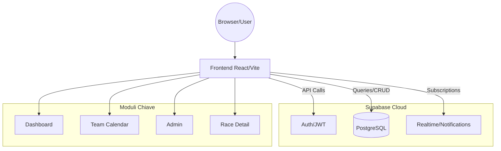

# Technical Specification: Triathlon Planner SaaS

## 1. Contesto e Obiettivi
Triathlon Planner SaaS è una piattaforma dedicata alla gestione coordinata di atleti, calendari gare e attività di team per società di triathlon. L'obiettivo è centralizzare le informazioni, facilitare l'onboarding degli atleti, la pianificazione degli eventi e la comunicazione interna, riducendo la complessità amministrativa.

## 2. Stack Tecnico
- **Frontend**: React 19, Vite, TypeScript, Tailwind CSS.
- **Backend / Database**: Supabase (Auth, PostgreSQL, Realtime, Edge Functions support).
- **Hosting**: Vercel (con Analytics e Speed Insights integrati).
- **Testing**: Playwright (UI e flussi critici).

## 3. Struttura Applicativa
L'applicazione è strutturata come una Single Page Application (SPA) gestita tramite `react-router-dom`.
- **Entry Point**: `main.tsx` inizializza il browser router e i provider globali.
- **Routing**: `App.tsx` definisce le rotte principali:
  - `/login`: Autenticazione (Supabase Auth).
  - `/`: DashboardPage (Root, protetta).
  - `/calendario-team`: TeamCalendarPage.
  - `/guida`: GuidePage.
  - `/race/:id`: RaceDetailPage.
  - `/admin`: AdminPage.

## 4. Architettura Logica

## 5. Moduli Funzionali
- **Dashboard**: Vista centrale per l'atleta/team, riepilogo prossime gare, alert, status.
- **Team Calendar / Admin / Race Detail**: Gestione calendario gare di squadra, pannello amministrativo per configurazione utenti/team, dettaglio tecnico specifiche gare.

## 6. Sicurezza
Il progetto adotta le best practice fornite da Supabase:
- **Autenticazione**: Gestita via Supabase Auth (JWT).
- **RLS (Row Level Security)**: Implementata e attiva su tutte le tabelle critiche per l'isolamento dei dati per `team_id`.
- **Implementazione Standard ZBN**:
  - [x] RLS implementate e attive.
  - [x] Trigger `handle_new_user` su `auth.users` per sincronizzazione profili/ruoli.
  - [x] Assenza di chiavi private o segreti esposti nel frontend.

## 7. Testing
- **E2E**: Playwright è utilizzato per la validazione automatizzata dei flussi di autenticazione e navigazione delle pagine principali (smoke tests).
- **Build**: Verifiche di integrità tramite `tsc` (configurate in pipeline CI).

## 8. Debito tecnico / punti da approfondire
- **Razionalizzazione**: `DashboardPage.tsx` e `AdminPage.tsx` tendono ad accumulare logica di business: è previsto l'estrazione dei componenti in hook o servizi separati.
- **Tipizzazione**: È in corso il rafforzamento delle definizioni dei dati provenienti da Supabase (generate types) per eliminare l'uso di `any`.
